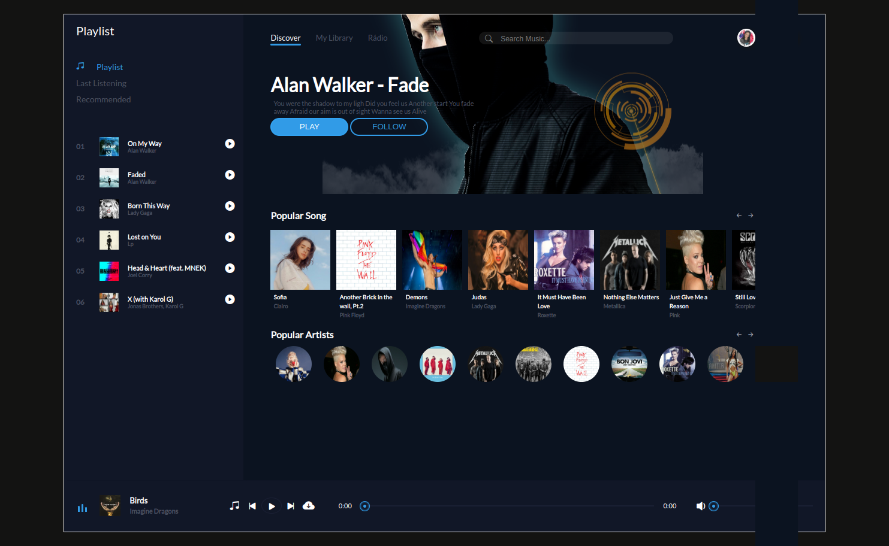

# Music-Player
------------------------------------------------------------------------------
<h1 align="center"> Imagem da interface do music player</h1>

------------------------------------------------------------------------------

<h1 align="center"> Como foi construido o projeto </h1>

 Projeto foi construído apenas com HTML, CSS e JavaScript. 
Contando com todas as funcionalidade que tem um player musical. 

------------------------------------------------------------------------------
<h1 align="center"> Versão do projeto</h1>

 Versão Desktop 
  

<h1 align="center"> Link do projeto </h1>

https://projeto-music-player.netlify.app/
